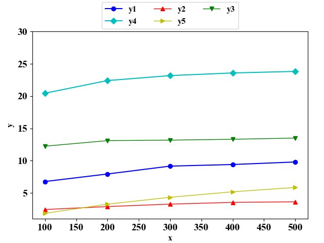
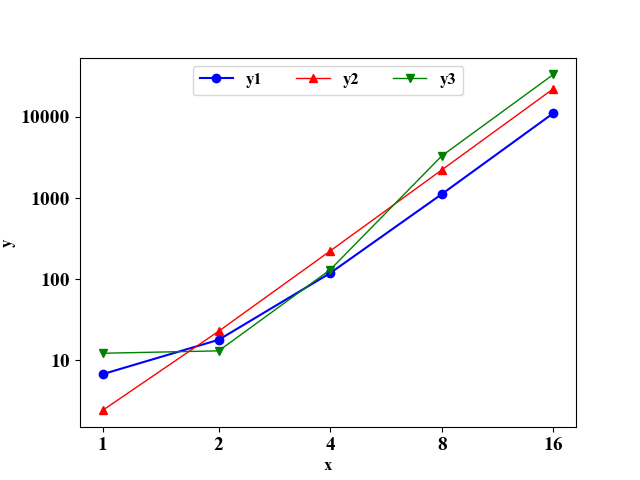
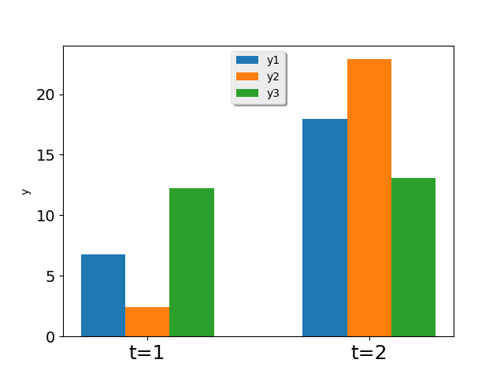

# 绘图
使用 matplotlib 绘制折线图。


<!-- toc -->

## 资源
* https://matplotlib.org/api/markers_api.html
* https://matplotlib.org/api/colors_api.html

## 简单折线图

```python
import matplotlib.pyplot as plt
import itertools


def flip(items, ncol):
    return itertools.chain(*[items[i::ncol] for i in range(ncol)])


def draw_line():
    plt.rcParams["font.family"] = "Times New Roman"
    plt.rcParams["font.size"] = "12"
    plt.rcParams["font.weight"] = "heavy"
    plt.subplots_adjust(left=0.1, right=0.95, top=0.87, bottom=0.1)

    plt.xticks(fontsize=14)
    plt.yticks(fontsize=14)

    plt.xlim(80, 520)
    plt.ylim(1, 30)
    x = [100, 200, 300, 400, 500]

    y1 = [6.76, 7.93, 9.15, 9.4, 9.79]
    y2 = [2.42, 2.88, 3.26, 3.53, 3.62]
    y3 = [12.24, 13.1, 13.18, 13.31, 13.5]
    y4 = [20.45, 22.41, 23.18, 23.59, 23.83]
    y5 = [1.83, 3.25, 4.32, 5.17, 5.84]

    plt.plot(x, y1, "bo-", label="y1")
    plt.plot(x, y2, "r^-", label="y2", linewidth=1)
    plt.plot(x, y3, "gv-", label="y3", linewidth=1)
    plt.plot(x, y4, "cD-", label="y4")
    plt.plot(x, y5, "y>-", label="y5", linewidth=1)

    ax = plt.gca()
    handles, labels = ax.get_legend_handles_labels()

    # 按照行方向排列 legend
    plt.legend(flip(handles, 3), flip(labels, 3), loc="upper center",
               bbox_to_anchor=(0.5, 1.18), ncol=3, fancybox=True,shadow=False)

    # 设置图片大小
    fig = plt.gcf()
    fig.set_size_inches(6, 4.8)

    plt.xlabel("x")
    plt.ylabel("y")
    plt.savefig('out/demo.eps', format='eps')
    plt.show()
```
结果：



## 指数坐标轴

```python
import matplotlib.pyplot as plt
import itertools
from matplotlib import ticker

def flip(items, ncol):
    return itertools.chain(*[items[i::ncol] for i in range(ncol)])

def draw_line_exp():
    plt.rcParams["font.family"] = "Times New Roman"
    plt.rcParams["font.size"] = "12"
    plt.rcParams["font.weight"] = "heavy"

    plt.xticks(fontsize=14)
    plt.yticks(fontsize=14)

    x = [1, 2, 4, 8, 16]

    y1 = [6.76, 17.93, 119.15, 1119.4, 11119.79]
    y2 = [2.42, 22.88, 223.26, 2223.53, 22223.62]
    y3 = [12.24, 13.1, 131.18, 3311.31, 33333.5]

    plt.plot(x, y1, "bo-", label="y1")
    plt.plot(x, y2, "r^-", label="y2", linewidth=1)
    plt.plot(x, y3, "gv-", label="y3", linewidth=1)

    ax = plt.gca()
    handles, labels = ax.get_legend_handles_labels()

    plt.legend(flip(handles, 3), flip(labels, 3), loc="upper center",
               ncol=3, fancybox=True, shadow=False)

    xlabs = [0.5, 1, 2, 4, 8, 16]

    # xlabs = [0, 10, 100, 1000]

    ax = plt.gca()
    ax.set_xticks(xlabs)
    ax.set_xticklabels(xlabs)
    ax.set_xlabel(xlabs)
    ax.set_xscale("symlog", basex=2, linthreshx=1.8)
    ax.xaxis.set_major_formatter(ticker.FormatStrFormatter("%d"))

    # ax.set_yticks(xlabs)
    # ax.set_yticklabels(xlabs)
    ax.set_yscale('symlog', basey=10, linthreshy=1.8)
    ax.yaxis.set_major_formatter(ticker.FormatStrFormatter("%d"))

    plt.xlabel("x")
    plt.ylabel("y")
    plt.savefig('out/demo.eps', format='eps')
    plt.show()
```

结果：



## 柱状图
```python
import matplotlib.pyplot as plt


def histogram():
    y1 = [6.76, 17.93]
    y2 = [2.42, 22.88]
    y3 = [12.24, 13.1]

    x = [1, 2]
    total_width, n = 0.8, 4
    width = total_width / n
    plt.bar(x, y1, label="y1", width=width)

    for i in range(len(x)):
        x[i] += width

    plt.bar(x, y2, label="y2", width=width)
    for i in range(len(x)):
        x[i] += width

    plt.bar(x, y3, label="y3", width=width)

    plt.legend(loc="upper center", fancybox=True, shadow=True)

    plt.xticks((1.2, 2.2), ("t=1", "t=2"), fontsize=18)
    plt.yticks(fontsize=14)

    plt.ylabel("y")
    plt.savefig('out/demo.eps', format='eps')
    plt.show()
```

结果：


